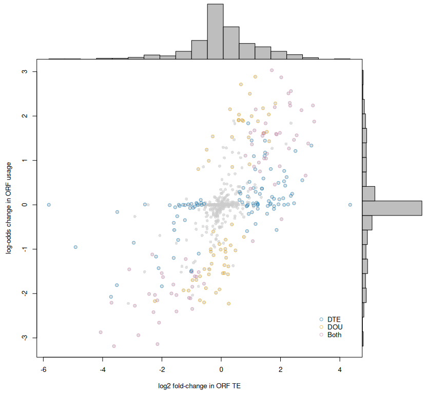
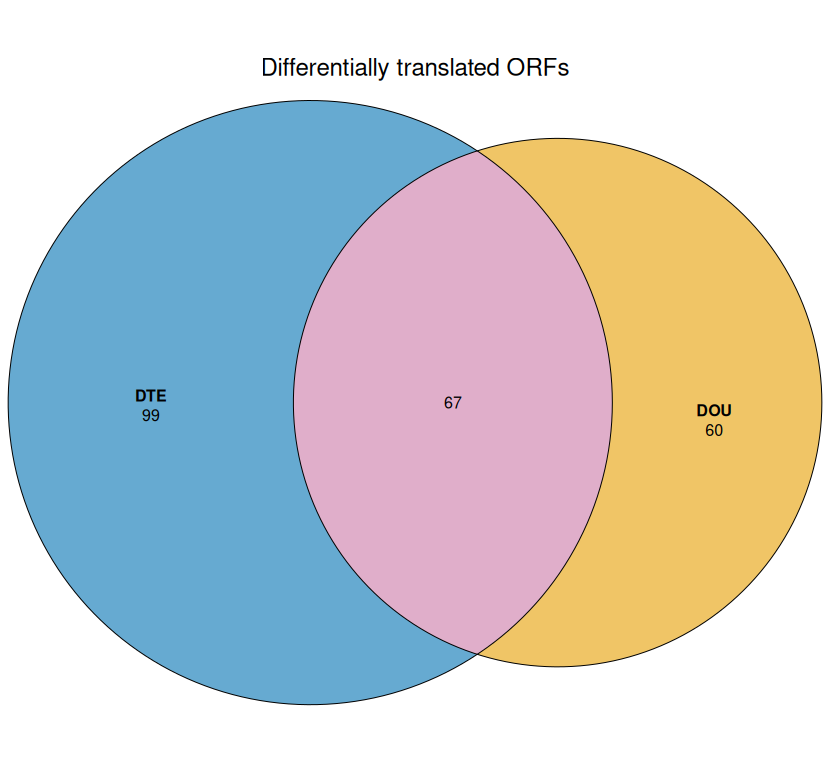

```{r echo=FALSE, include=FALSE}
knitr::opts_chunk$set(tidy = FALSE,
                      cache = TRUE,
                      dev = "png",
                      message = FALSE,
                      error = FALSE,
                      warning = FALSE)
```

# Introduction
`DOTSeq` is an R package for identifying differentially translated open reading frames (ORFs) from ribosome profiling (Ribo-seq) and matched RNA-seq datasets. Unlike traditional gene-level approaches, DOTSeq performs analysis at the ORF level, enabling detection of:
- Differential ORF Usage (DOU) — changes in ORF usage within the same gene.
- Differential Translation Efficiency (DTE) — changes in ribosome loading relative to RNA level across conditions.

`DOTSeq` models Ribo-seq and RNA-seq read counts using a beta-binomial generalised linear model (GLM) implemented via `glmmTMB`. It supports experimental designs with multiple conditions, and uses an interaction term `(condition:strategy)` to isolate translation-specific effects.

Post hoc contrasts are computed using `emmeans`, and empirical Bayes shrinkage is applied via `ashr`.

# Load Library
First, we need to load the `DOTSeq` library.

```{r setup,warning=FALSE}
library(DOTSeq)
```

# Example Dataset
To demonstrate the use of `DOTSeq`, we use the dataset generated by [Ly et al. (2024)](https://doi.org/10.1038/s41586-024-08088-3). They investigated the stringency of start codon selection in 3 different mammalian cell cycle stages. They prepared paired translation initiation site profiling, elongating ribosome profiling, and RNA sequencing data for synchronized interphase, mitotic arrested, and cycling mitotic HeLa cells. Two biological replicates were performed for each cell cycle stage. The raw sequencing reads are deposited on the NCBI Gene Expression Omnibus (GEO) under the accession number [GSE230189](http://www.ncbi.nlm.nih.gov/projects/geo/query/acc.cgi?acc=GSE230189).
```{r dir}
dir <- system.file("extdata", package = "DOTSeq")
list.files(dir)
```

# Input data
Both Ribo-seq and match RNA-seq reads has been preprocessed by aligning to the reference genome using a splice-aware aligner, such as STAR or HISAT2 and the counts were aggregated per ORF based on the flattened annotation using featureCounts. 
This table should include both the Ribo- and RNAseq data combined. It should also be organised as a dataframe with rows correspond to genes, while the first 6 columns contains the default output from featureCounts and all columns after that correspond to the counts of each to sample as shown below.
```{r read-in-count-file}
cnt <- read.table(file.path(dir, "featureCounts.dotseq.out.gz"), header=TRUE, comment.char ='#')
names(cnt) <- gsub(".*(SRR[0-9]+).*", "\\1", names(cnt))
```
We can check the first five lines of the table:
```{r count-table-example}
head(cnt)
```

Since the dataset is large, users can speed up vignette execution by using the `make_subset` function to create a smaller dataset before proceeding.
```{r cnt-subset}
df <- read.csv(file.path(dir, "subset_20.csv"), header = TRUE)
cnt <- make_subset(df, cnt, seed = 123)
# cnt <- read.table(file.path(dir, "featureCounts.dotseq.out.gz"), header=TRUE, comment.char ='#')
# names(cnt) <- gsub(".*(SRR[0-9]+).*", "\\1", names(cnt))
```

# Annotation files 
To allow ORF level analysis, DOTSeq requires flatten reference GTF annotation and BED files with discrete, non-overlapping ORF annotation describing the genomic locations of ORFs. These annotation files, were generated using the orf_to_gtf.py wrapper from the RIBOSS engine. 
Here, we specify the file path for the annotation files:
```{r ref}
flat <- file.path(dir, "dotseq.gtf.gz")
bed <- file.path(dir, "dotseq.bed.gz")
```

# Prepare Condition Table
A condition (metadata) table is required to define the experimental design for both Ribo-seq and RNA-seq samples. 
This table must include four essential columns: run (sample identifier), strategy (sequencing type, either "ribo" or "rna"), replicate (biological replicate number), and condition (biological condition, such as treatment or control). 
Additional columns may also be included to capture study-specific factors, for example batch information or other variables that could influence the analysis.
In this example, an extra column treatment was included to reflect the two experimental treatments applied in [Ly et al. (2024)](https://doi.org/10.1038/s41586-024-08088-3)[@Ly2024].
```{r condition-table}
meta <- read.table(file.path(dir, "metadata.txt"))
names(meta) <-  c("run","strategy","replicate","treatment","condition")
head(meta)
```
In this example, we are interested in studying the differential ORF translation between Interphase and Mitotic Cycling and cells that were treated with cyclohexamide (chx).
```{r extract-chx}
cond <- meta[meta$treatment=="chx",] # extract only samples treated with cyclohexamide
cond$treatment <- NULL # remove the treatment column
```

# Testing for Differential ORF Translation
The next step is to apply fitDOT, which fits beta-binomial and negative binomial generalized linear models to test for differential ORF translation (DOT). Users can explicitly define the target and baseline conditions of their experiment, ensuring results are aligned with their study design.
In addition to model fitting, fitDOT automates several key preprocessing steps:
- loading count data
- aligning samples with metadata
- filtering ORFs
- normalizing counts
- calculating translational efficiency
By default, fitDOT uses the formula ~ condition * strategy, but users may supply their own formula for more complex experimental designs (e.g., batch effects, interaction terms). Users are

This flexibility allows `fitDOT` to accommodate both simple and advanced study setups.
Finally, the fitted object can be saved and exported for downstream analyses:
```{r fitdot}
fmla <- ~ condition * strategy
m <- fitDOT(
  count_table = cnt, 
  condition_table = cond, 
  flattened_gtf = flat, 
  bed = bed, 
  target = "Mitotic_Cycling", 
  baseline = "Interphase", 
  formula = fmla,  
  stringent = TRUE, 
  verbose = TRUE
)
saveRDS(m, file = file.path(dir, "fitDOT_ly_2024_subset.rds"))
```

# DOTSeq object
The returned object m from the fitDOT function contains results from both the Differential ORF Usage (DOU) and Differential Translational Efficiency (DTE) modules
## Differential ORF Usage (DOU):
  We can now parse the fitted GLMM object `m` to `contrastDOU` to perform DOU analysis. `contrastDOU` uses the estimated marginal means (EMMs) from `m` to compute contrasts between conditions, capturing how translation of individual ORFs changes relative to mRNA abundance.
  ```{r dou-contrast}
  dou <- contrastDOU(m, nullweight = 500)
  ```
  Within the dou results object, there are two main components: strategy_specific and interaction_specific.
  ```{r dou-names}
  names(dou)
  ```
  `interaction_specific` contains the main results for DOU, the differential ORF usage derived from the interaction term. This is the part you would typically focus on when interpreting changes in ORF usage between conditions.
  ```{r dou-is-names}
  names(dou$interaction_specific)
  ```
  * Notes: Within `contrastDOU`, the interaction terms are flipped due to the way the `emmeans` package handles contrasts. This behavior is accounted for, and the terms are flipped back in the final results and plots.

  `strategy_specific` contains additional results computed separately for each strategy:
  - `0` corresponds to differential expression analysis at the RNA level.
  - `1` corresponds to differential analysis of ribosome footprints, not strictly “differential translation” as in DTE.
  ```{r dou-ss-names}
  names(dou$strategy_specific)
  ```

## Differential Translational Efficiency (DTE):
  The results for DTE are stored in the `dds` object within `m` and the since DTE leverages the DESeq2 model type, we are able to list the available contrast with resultsName function from DESeq2.
  ```{r dte-contrast}
  resultsNames(m$dds)
  ```
  The effect size shrinkage for DTE, can be performed with DESeq2's `lfcShrink` function. 
  Since we are interested in looking at the DOT of Interphase vs Mitotic Cycling, we extracted the coefficient for the Mitotic Cycling Strategy.
  ```{r dte}
  dte <- lfcShrink(m$dds, coef = "conditionMitotic_Cycling.strategy1")
  dte <- as.data.frame(dte)
  ```

# Merging Results for Visualization
To prepare the results for visualization, we first merge the outputs from both modules into a single dataframe, aligning them by ORF ID. 
We then incorporate the corresponding ORF annotations from the m$orfs dataframe, ensuring that the detected ORFs are included in the final results. 
The combined dataframe can then be exported for downstream analysis or visualization.
```{r merge-df}
df <- merge(dou$interaction_specific$`Interphase - Mitotic_Cycling`, dte, by.x = "row.names", by.y = "row.names")
df <- df[!is.na(df$lfsr) | !is.na(df$padj), ]

df <- merge(df, m$orfs[names(m$orfs) %in% c("groupID","labels")], by.x = "Row.names", by.y = "row.names", all.x = TRUE)
write.table(df, file = file.path(dir, "DOTSeq_results_MC_vs_I.csv"), quote = FALSE, sep = '\t', row.names = FALSE)
```
# Column description of the main DOTSeq output (DOTSeq_results_MC_vs_I.csv)
| column | Module  | Name           | DEscription                                                                                                                                                               |
|--------|---------|----------------|-----------------------------------------------------------------------------------------------------------------------------------------------------------|
| 1      | DOU     | Row.names      | Open reading frame identification.                                                                                                                                                            |
| 2      | DOU     | betahat        |
| 3      | DOU     | sebetahat      |
| 4      | DOU     | WaldP          |
| 5      | DOU     | WaldPadj       |
| 6      | DOU     | PosteriorMean  |
| 7      | DOU     | lfsr           |
| 8      | DOU     | lfdr           |
| 9      | DOU     | qvalue         |
| 10     | DTE     | log2FoldChange |
| 11     | DTE     | lfcSE          |
| 12     | DTE     | pvalue         |
| 13     | DTE     | padj           |
| 14     | -       | groupID        | 
| 15     | -       | labels         |

# Visualisation
`plotDOT` generates a scatter plot that compares DTE and DOU results side by side. Each point represents an ORF, positioned by its DTE and DOU effect sizes. 
To enhance interpretability, the plot includes marginal histograms along each axis, showing the distribution of DTE and DOU separately. 
The points are also color-coded by significance, allowing users to distinguish ORFs significance in DTE, DOU, or both modules.
```{r plotdot}
plotDOT(res = df)
```



Users can also specify which ORF they want to compare on the heatmap and it will be saved as a .pdf format. 
For example, this heatmap is showing the differential translation between uORF and mORF:
```{r uORF_heatmap}
dou_go_20_80 <- plotHeatmap(results =  df_20_80, orf_type = "uORF", flip_sign = TRUE, species_dataset = "hsapiens_gene_ensembl", symbol_col = "hgnc_symbol")
```


# Session Info
```{r sessionInfo}
sessionInfo()