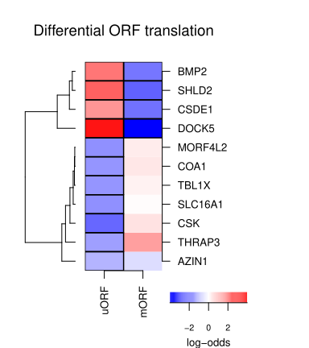
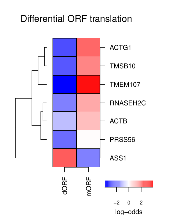

```{r echo=FALSE, include=FALSE}
knitr::opts_chunk$set(tidy = FALSE,
                      cache = TRUE,
                      dev = "png",
                      message = FALSE,
                      error = FALSE,
                      warning = FALSE)
```

# Introduction
DOTSeq is a R package for identifying differentially translated open reading frames (ORFs) from paired Ribo- and RNAseq data. Unlike most existing tools that operate at gene level, DOTSeq performs analysis at the ORF level, enabling the detection of:

* Differential translation between conditions, and
* Occupancy shifts of ribosomes on ORFs within a single gene

DOTSeq integrates both Ribo- and RNAseq read counts into a single generalized linear model (GLM) using a modified design matrix and model fitting formula inspired by [Riborex](https://github.com/smithlabcode/riborex) and 
[satuRn](https://github.com/statOmics/satuRn) respectively. At present, DOTSeq only accepts count data generated with [featureCounts](https://subread.sourceforge.net/featureCounts.html). Development is underway to extend support for additional quantification tools, including `mmquant` and `HTseq`.

# Load Library
First, we need to load the DOTSeq library.

```{r setup,warning=FALSE}
library(DOTSeq)
```

# Example Dataset
To demonstrate the use of `DOTSeq`, we use the dataset generated by [Ly et al. (2024)](https://doi.org/10.1038/s41586-024-08088-3). They investigated the stringency of start codon selection in 3 different mammalian cell cycle stages. They prepared paired translation initiation site profiling, elongating ribosome profiling, and RNA sequencing data for synchronized interphase, mitotic arrested, and cycling mitotic HeLa cells. Two biological replicates were performed for each cell cycle stage. The raw sequencing reads are deposited on the NCBI Gene Expression Omnibus (GEO) under the accession number [GSE230189](http://www.ncbi.nlm.nih.gov/projects/geo/query/acc.cgi?acc=GSE230189).
```{r dir}
dir <- system.file("extdata", package = "DOTSeq")
list.files(dir)
```

# Input Data 
The input for DOTSeq is the read counts table summarized from featureCounts. This table should include both the Ribo- and RNAseq data combined. It should also be organised as a dataframe with rows correspond to genes, while the first 6 columns represents what is in the column names and all columns after that correspond to the counts of each to sample as shown below.
```{r read-in-input-file}
cnt <- read.table(file.path(dir, "featureCounts.dotseq.out.gz"), header=TRUE, comment.char ='#')
names(cnt) <- gsub(".*(SRR[0-9]+).*", "\\1", names(cnt))
```
We can check the first five lines of the table:
```{r count-table-example}
head(cnt)
```
DOTSeq also requires annotation files describing the genomic locations of ORFs (open reading frames). Here, we specify the file path for the annotation files:
```{r ref}
flat <- file.path(dir, "dotseq.gtf.gz")
bed <- file.path(dir, "dotseq.bed.gz")
```

# Prepare Condition Table
A condition (metadata) table is also needed to specify experimental design information for both Ribo-seq and RNA-seq samples. This table must contain four required columns: run (sample identifier), strategy (sequencing type; e.g., Ribo-seq or RNA-seq), condition (biological condition), and replicate (biological replicate number). Users may also include additional columns as needed to capture study-specific variables. In our case, an extra column treatment was included to reflect the two experimental treatments applied in [Ly et al. (2024)](https://doi.org/10.1038/s41586-024-08088-3)[@Ly2024].
```{r condition-table}
meta <- read.table(file.path(dir, "metadata.txt"))
names(meta) <-  c("run","strategy","replicate","treatment","condition")
head(meta)
```
In this example, we will only look at the cells treated with cyclohexamide (chx).
```{r extract-chx}
cond <- meta[meta$treatment=="chx",]
cond$treatment <- NULL
```

# Testing for Differential ORF Translation
After the read count table and condition dataframe is ready, we can use fitDOT(). This function integrates the dispersion estimation and normalization approach from [DESeq2](https://github.com/thelovelab/DESeq2) and the design matrix inspired by [Riborex](https://github.com/smithlabcode/riborex/tree/master) to prepare a [satuRn](https://github.com/statOmics/satuRn) model fitting formula[@deseq2;@saturn,@riborex].
```{r model-fitting}
m <- fitDOT(countTable = cnt, conditionTable = cond, flattenedFile = flat, bed = bed, stringent = TRUE, verbose = TRUE)
```
*Note: With `stringent=TRUE`, fitDOT removes single-ORF genes and users should set this as 'TRUE' if wanting to calculate the occupancy shift. 

The default formula for `DOTSeq` is `~0 + condition + replicate + modality + effect1 + effect2`

# Contrast
Once the model is fitted using fitDOT(), users can select the specific contrast (i.e., condition comparison) they wish to test from the contrast matrix stored in the output object `m`. 
```{r contrast-viewing}
colnames(m$contrastMat)
```
This function will also generate a volcano plot. For example, the following code tests the second contrast (Mitotic Cycling vs Interphase) in the matrix:
```{r contrast-testing}
results <- testDOT(sumExp = m$sumExp, m$contrastMat[, 2], main = colnames(m$contrastMat)[[2]], diagplot1 = TRUE, diagplot2 = TRUE)
results <- merge(m$orfs, results, by = "row.names")
```
From this object, we can also obtain the dataframe of differentially translated ORFs that are significant with a false discovery rate of 5%:
```{r sigRes}
sigRes <- results[results$empirical.fdr<0.05,]
```

# Visualisation
Users can specify which ORF they want to compare on the heatmap and it will be saved as a .pdf format. 
For example, this heatmap is showing the differential translation between uORF and mORF:
```{r uORF_heatmap}
pairedDOTHeatmap(results, "uORF", "hsapiens_gene_ensembl", "hgnc_symbol", "uORF.dot.pdf")
```


and this heatmap is showing the differential translation between dORF and mORF:
```{r dORF_heatmap}
pairedDOTHeatmap(results, "dORF", "hsapiens_gene_ensembl", "hgnc_symbol", "dORF.dot.pdf")
```


# Session Info
```{r sessionInfo}
sessionInfo()
```
